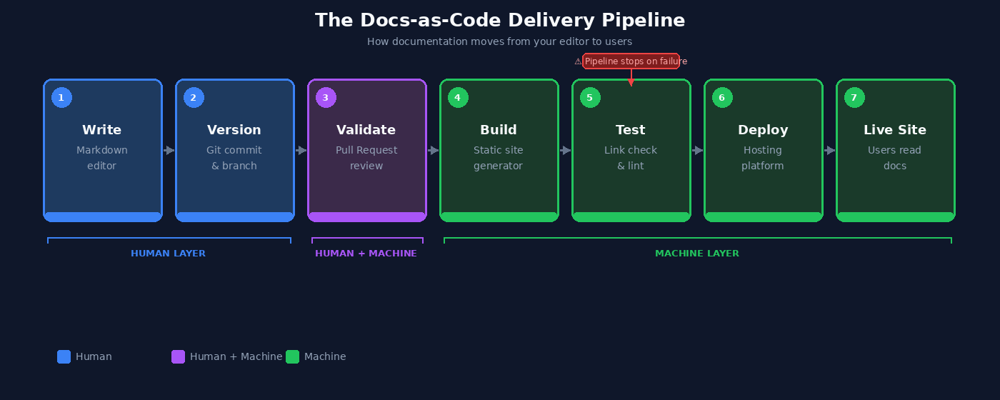

# Part 5: CI/CD for Technical Writers — How Documentation Goes from Repository to Live Site

In Part 4, we examined how Pull Requests validate documentation state before it becomes authoritative.

A Pull Request acts as a control gate. It determines whether a proposed documentation change is approved for production. But approval alone does not make documentation visible to users. Something still has to deliver it.

That final step — moving validated documentation from the repository into a live environment — is handled by CI/CD pipelines.

By the end of this article you will understand:

- What happens to documentation between a merge and a live site
- What CI and CD mean in the context of documentation delivery
- How each stage of a documentation pipeline works
- What preview deployments and staging environments are for
- How to interpret a pipeline failure and trace it back to its source

---

## The Missing Step Between Merge and Production

When a Pull Request is merged into the primary branch, a new documentation state becomes authoritative inside the repository.

But the repository itself is not what users read. Users read documentation hosted on a documentation website, a developer portal, a static documentation platform, or an internal knowledge base.

For the repository version to appear there, something must:

1. Detect that a new version exists
2. Build the documentation site from source files
3. Deploy it to the hosting environment

This sequence is automated through **Continuous Integration / Continuous Deployment** — commonly referred to as CI/CD.

---

## The Docs-as-Code Delivery Pipeline

The diagram below shows the complete lifecycle of documentation in a Docs-as-Code system — from the moment you start writing to the moment a user reads the result.



The pipeline has three distinct layers of responsibility:

| Layer | Stages | Who is responsible |
|-------|--------|-------------------|
| **Human** | Write, Version | The technical writer — creation, intent, and commit history |
| **Human + Machine** | Validate | Pull Request review combines human approval with automated checks |
| **Machine** | Build, Test, Deploy, Live Site | The CI/CD pipeline — fully automated after merge |

Once a Pull Request is merged, the pipeline takes over completely. No manual publishing step is required.

---

## What CI/CD Actually Means

**Continuous Integration (CI)** means changes are automatically built and tested as soon as they are merged. Problems are caught immediately rather than discovered after publication.

**Continuous Deployment (CD)** means a successfully built and tested version is automatically delivered to the live environment without manual intervention.

For documentation, the pipeline performs three tasks in sequence:

1. **Build** — convert source Markdown files into a fully generated documentation site
2. **Test** — run automated checks to validate documentation quality
3. **Deploy** — publish the generated site to the hosting environment

These three tasks run automatically after every merge to the primary branch.

---

## A Typical Documentation Deployment Pipeline

Most Docs-as-Code systems follow this sequence:

```
Commit → Pull Request → Merge → CI Pipeline Triggered → Build → Test → Deploy → Live Site
```

---

### Stage 1 — The Merge Triggers the Pipeline

When a Pull Request is merged into the primary branch — `main` in modern repositories, `master` in older ones — GitHub detects the change and starts the automated workflow.

> **Note:** `main` and `master` refer to the same concept: the primary branch of a repository. GitHub changed its default from `master` to `main` in 2020. You may encounter either name depending on when a repository was created.

The workflow is defined in a configuration file stored inside the repository itself. In GitHub, this file lives at:

```
.github/workflows/deploy-docs.yml
```

> **What this file is:** A YAML configuration file that tells GitHub Actions what to do and when to do it. In most teams, this file is created and maintained by a developer or DevOps engineer — technical writers are not expected to write it from scratch, but understanding its structure helps you read pipeline logs and collaborate more effectively when something goes wrong.

**Example trigger configuration:**

```yaml
# Start the pipeline whenever the main branch is updated
on:
  push:
    branches:
      - main
```

Whenever a change is merged into `main`, this trigger fires and the pipeline begins. The merge is the signal that a new documentation state is ready to be built.

---

### Stage 2 — The Documentation Site Is Built

Most Docs-as-Code systems use **static site generators** — tools that convert Markdown source files into a fully built website with HTML pages, navigation, search indexes, and static assets.

Common static site generators used for documentation:

| Generator | Common use case |
|-----------|----------------|
| MkDocs | Technical and API documentation |
| Docusaurus | Developer documentation portals |
| Sphinx | Python project documentation |
| Hugo | General documentation sites |

**Example build step:**

```yaml
- name: Build Documentation
  run: mkdocs build
```

If the build fails — for example, because a referenced file is missing or a navigation configuration is invalid — the pipeline stops immediately. Nothing is deployed until the problem is resolved.

---

### Stage 3 — Automated Validation Checks Run

Before deployment, the pipeline runs automated checks to enforce documentation quality.

| Check | What it catches |
|-------|----------------|
| Link validation | Broken internal and external links |
| Markdown linting | Formatting and style inconsistencies |
| Spellchecking | Spelling errors across all files |
| Build integrity | Warnings that indicate structural problems |

**Example — strict build mode:**

```yaml
- name: Build Documentation (strict mode)
  run: mkdocs build --strict
```

The `--strict` flag treats warnings as errors — if any warning occurs during the build, the pipeline fails and deployment stops. This makes documentation quality enforceable at the repository level rather than dependent on manual review.

If any check fails, the pipeline halts and a failed status appears on the Pull Request. The pipeline resumes only after the issue is corrected and a new commit is pushed.

---

## Preview Deployments — Seeing Documentation Before It Goes Live

Many CI/CD platforms — including Netlify, Vercel, and GitHub Actions — automatically generate a temporary preview site for every Pull Request before it is merged.

```
Open PR → Pipeline runs → Preview URL generated → Reviewers check rendered site
```

Preview deployments allow writers and reviewers to see exactly how documentation will render in a browser before any change goes live. This catches problems that are invisible in raw Markdown:

- Navigation structure issues
- Image rendering failures
- Formatting inconsistencies across pages
- Layout problems at different screen sizes

Reviewing a rendered preview is more accurate than reviewing Markdown source because it replicates the actual user experience.

---

## Staging vs Production Environments

Some documentation teams add an intermediate step between validation and public publication.

Rather than deploying directly to the public-facing site, the pipeline first deploys to a **staging environment** — a private, internal copy of the documentation that mirrors what production will look like.

```
Merge → Build → Test → Staging Site → Internal review → Production Site
```

Staging is most useful when:

- Documentation changes are large or structurally significant
- Multiple stakeholders need to review before publication
- Changes must be coordinated with a specific product release date

When internal review is complete, a second pipeline step promotes the staging version to production. No manual file transfer is involved — the pipeline handles both deployments.

---

## When the Pipeline Fails

For most technical writers, the first direct interaction with CI/CD happens when the pipeline fails. On GitHub, a failed pipeline appears as a red ✗ next to a commit or on a Pull Request.

**How to investigate a pipeline failure:**

1. Click **Details** next to the failed check
2. Open the build logs
3. Read the error message — it will identify the file and the line number where the problem occurred
4. Fix the issue locally, commit the correction, and push — the pipeline runs again automatically

**Common causes of documentation pipeline failures:**

| Error type | Example |
|------------|---------|
| Broken internal link | `docs/api/authentication.md line 42: target not found` |
| Missing file | `image referenced in index.md not found` |
| Invalid Markdown | `unexpected heading level` |
| Navigation config error | `mkdocs.yml: page listed but file missing` |

You do not need to understand the entire pipeline to resolve most failures. You need to find the error message, trace it to the source file, and fix the specific problem it identifies. Pipeline logs are written to be read — even by non-engineers.

---

## The Complete Docs-as-Code Lifecycle

At this point in the series, the full structure is visible:

| Stage | System | Responsibility |
|-------|--------|---------------|
| Writing | Markdown | Human — creation and judgement |
| Versioning | Git | Human — intent and history |
| Validation | Pull Request | Human + Machine — review and automated checks |
| Build | CI Pipeline | Machine — compilation |
| Test | CI Pipeline | Machine — quality enforcement |
| Deploy | CD Pipeline | Machine — delivery |
| Live Site | Hosting platform | Machine — availability |

Each layer adds a specific kind of structure. Together they form a complete, auditable documentation delivery system.

---

## What This Means for Technical Writers

Understanding CI/CD is not about learning DevOps — it is about understanding the system your work moves through.

In a Docs-as-Code environment:

- Your writing creates a documentation state
- Git records that state with full history and attribution
- Pull Requests validate that state before it advances
- CI/CD pipelines deliver that state to users automatically

You are not simply updating documents. You are contributing to a controlled production system — the same kind of system that engineers use to ship code. Understanding that system makes collaboration with engineering teams significantly more effective. You can read a pipeline log, understand why a check failed, interpret a preview deployment, and contribute to conversations about documentation infrastructure.

That shared understanding is one of the most valuable capabilities a technical writer brings to a product team.

---

## Summary

- The repository is not what users read — CI/CD is the system that moves documentation from repository to live site
- **CI** builds and tests documentation automatically after every merge; **CD** deploys it to the live environment without manual steps
- The pipeline sequence is: **Merge → Build → Test → Deploy → Live Site**
- Workflow configuration lives in `.github/workflows/deploy-docs.yml` — a YAML file maintained by your team's engineering or DevOps function
- **Preview deployments** generate a temporary rendered site for every PR, allowing reviewers to evaluate the actual documentation experience before merge
- **Staging environments** add a private review step between validation and public publication
- Pipeline failures appear as a red ✗ — click Details, read the log, find the file and line number, fix and push
- The `--strict` build flag makes documentation quality enforceable at the pipeline level

---

## Next in This Series

→ [Part 6 — Documentation Repository Architecture: Structuring Docs That Scale](part-6-repo-architecture.md)

---
