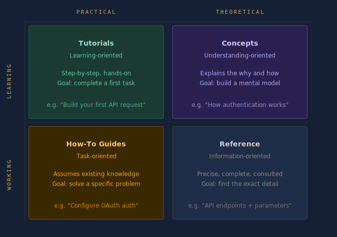

# Part 6: Documentation Architecture for Technical Writers

This article explains how to structure documentation repositories for scale — covering the principles, frameworks, and practical patterns that keep documentation maintainable as products grow.

By the end of this article you will understand:

- Why documentation systems decay over time and what causes it
- How the Diátaxis framework organises documentation into four distinct types
- How to structure a documentation repository using clear folder conventions
- How the Single Source of Truth principle prevents content duplication
- How the README serves as the front door for contributors
- How internal linking strategy reduces maintenance cost
- How documentation architecture enables automation

---

## Why Structure Matters

In Part 5, we examined how CI/CD pipelines carry documentation from a validated repository state to a live site — automatically, without manual publishing.

At that point, the operational infrastructure is in place.

Documentation is written in Markdown. Versioned in Git. Validated through Pull Requests. Built and deployed through CI/CD pipelines.

But one critical layer still remains.

Even with perfect commits, clean Pull Requests, and automated deployment, documentation can still fail if the information itself is poorly structured.

This is where documentation architecture becomes essential.

Documentation is not just content. It is an information system. And like any system, it must be designed to scale.

---

## Documentation Entropy

In the early stages of a project, documentation often begins simply.

A few guides. A quick start page. Some API notes.

But as the product grows, something predictable happens.

Pages accumulate. Topics overlap. Old information remains alongside new information. Guides multiply without clear ownership.

This gradual decay is called **documentation entropy**.

Symptoms include:

- Duplicate pages explaining the same concept
- Outdated tutorials that no longer match the product
- Conflicting instructions across different guides
- Navigation that feels chaotic rather than intentional

Developers have a familiar term for this in codebases: **technical debt**.

Documentation suffers from something similar — **information debt**.

The root cause is rarely bad intentions. It is missing architecture.

---

## Documentation as an Information System

When documentation is treated as a simple collection of pages, it becomes difficult to maintain.

When it is treated as an information system, the focus shifts from writing individual pages to designing how information is organised and accessed.

A well-structured documentation system supports four fundamental needs:

- **Discoverability** — Users must be able to find information quickly
- **Navigation** — Readers should move through documentation logically
- **Task completion** — Documentation must guide users toward real outcomes
- **Learning progression** — Readers should be able to deepen their understanding over time

These goals cannot be achieved through writing quality alone. They require intentional architecture.

---

## The Diátaxis Framework

One of the most widely adopted models for structuring documentation is the **Diátaxis framework**.

It separates documentation into four distinct types, each serving a different reader need.

| Documentation Type | Purpose |
|-------------------|---------|
| Tutorials | Teach beginners step-by-step |
| How-To Guides | Help users accomplish specific tasks |
| Reference | Provide precise technical details |
| Concepts | Explain how the system works |


---

### Tutorials

Help readers learn by doing.

**Example:** "Build your first API request in five minutes."

A tutorial is not concerned with completeness. It is concerned with forward momentum. The reader should finish having done something — and feeling capable of continuing.

---

### How-To Guides

Help readers solve specific practical problems.

**Example:** "How to configure OAuth authentication."

A how-to guide assumes the reader already has basic knowledge. It does not teach fundamentals — it solves a defined problem efficiently.

---

### Reference

Provides exact technical information.

**Example:** API endpoints, parameters, command syntax, configuration options.

Reference documentation is consulted, not read from start to finish. Precision and completeness matter more than narrative flow.

---

### Concepts

Explains how the system works internally.

**Example:** "How authentication works in our API architecture."

Conceptual documentation gives readers the mental model they need to use the product confidently. It answers the question: *why does this work the way it does?*

---

### Why Separation Matters

These documentation types should not be mixed together.

A tutorial should not suddenly become a reference manual. A reference page should not read like a tutorial.

Each serves a different reader mindset. When readers arrive at a page, they come with a specific intent. If the page serves a different intent, they leave without completing their task.

Architecture makes those boundaries clear and keeps readers oriented.

---

## Structuring a Repository

In Docs-as-Code environments, documentation lives inside the same repository as the product.

A clear structure based on the Diátaxis framework looks like this:

```
docs/
 ├── tutorials/
 │    └── getting-started.md
 ├── guides/
 │    └── configure-authentication.md
 ├── reference/
 │    └── api-endpoints.md
 ├── concepts/
 │    └── how-authentication-works.md
 ├── snippets/
 │    └── auth-prerequisites.md
 └── images/
      └── architecture-diagram.png
```

This layout provides several benefits:

- Writers know where new documentation belongs
- Reviewers understand the purpose of each page before reading it
- Documentation site generators can build navigation automatically
- Readers can locate the type of information they need without searching

---

## Single Source of Truth

One of the core principles in software engineering is **DRY — Don't Repeat Yourself**.

The same principle applies to documentation.

In large documentation sets, certain content appears repeatedly — warning notices, prerequisites, configuration steps, code snippets. When this content is copied manually, a predictable problem follows: the product changes, one copy gets updated, and the others don't. Readers encounter conflicting information depending on which page they land on.

Good architecture solves this through **content inclusions** — writing content once and referencing it from multiple pages.

**Example — MkDocs snippets extension:**

```markdown
<!-- In guides/configure-authentication.md -->
## Prerequisites
--8<-- "snippets/auth-prerequisites.md"

<!-- In tutorials/getting-started.md -->
## Before You Begin
--8<-- "snippets/auth-prerequisites.md"
```

Both pages display the same prerequisites block. When the prerequisites change, you update one file and every page that references it updates automatically.

This is one of the most practical benefits of treating documentation as code.

---

## The README as the Front Door

The `README.md` at the root of your `docs/` folder is the most important piece of documentation architecture for contributors.

For readers, the homepage of your documentation site is the entry point. For **writers and contributors**, the `docs/README.md` is the front door to the documentation system itself.

A well-written docs README answers four questions:

1. What is the structure of this repository?
2. Where does new documentation belong?
3. What conventions does this project follow?
4. How do I contribute?

**Example — docs/README.md:**

```markdown
# Documentation

This folder contains all documentation for [Product Name].

## Folder Structure

| Folder | Purpose |
|--------|---------|
| `tutorials/` | Step-by-step guides for new users |
| `guides/` | Task-focused how-to guides |
| `reference/` | API and configuration reference |
| `concepts/` | Explanations of how the system works |
| `snippets/` | Reusable content blocks |
| `images/` | Screenshots and diagrams |

## Contributing

Before adding a new page, identify which category it belongs to.
See [CONTRIBUTING.md](../CONTRIBUTING.md) for full guidelines.
```

This file costs very little to write. For anyone joining the project later — an engineer contributing their first documentation page, a new technical writer onboarding — it is the difference between confidence and confusion.

---

## Architecture Improves Collaboration

When structure exists:

- Engineers know where to contribute documentation
- Reviewers understand the context of a page before reading it
- Writers maintain consistency across large documentation sets

Without structure, teams debate basic questions before any writing begins: *Where should this page live? Is this a guide or a tutorial? Should this replace another page?*

Architecture answers those questions before they arise. A structured repository functions as a shared agreement — and that agreement reduces friction across every Pull Request.

---

## Architecture Enables Automation

Documentation tools such as MkDocs, Docusaurus, Sphinx, and Hugo depend on structured directories to generate navigation, build search indexes, validate internal links, and render documentation sites correctly.

**Example — MkDocs navigation configuration:**

```yaml
# mkdocs.yml

nav:
  - Home: index.md
  - Tutorials:
    - Getting Started: tutorials/getting-started.md
  - How-To Guides:
    - Configure Authentication: guides/configure-authentication.md
  - Reference:
    - API Endpoints: reference/api-endpoints.md
  - Concepts:
    - How Authentication Works: concepts/how-authentication-works.md
```

When the directory structure matches the navigation configuration, the pipeline builds correctly every time. When structure is inconsistent, automation breaks — missing files, broken links, and failed builds become routine problems rather than rare exceptions.

---

## Practical Exercise: Audit Your Documentation

Before restructuring a project, understand the state of what already exists.

**Step 1 — List every page in your documentation.**

```bash
find docs/ -name "*.md" | sort
```

**Step 2 — Categorise each page using the Diátaxis framework.**

For each file, ask: is this a tutorial, a how-to guide, a reference page, or a conceptual explanation?

If it is difficult to categorise, the page may be mixing purposes.

**Step 3 — Identify gaps and overlaps.**

Look for:

- Categories with no pages (a gap)
- Multiple pages covering the same topic (an overlap)
- Pages that belong to more than one category (a mixing problem)

**Step 4 — Propose a new structure.**

Sketch a folder structure that reflects the Diátaxis framework.

You do not need to migrate everything immediately. Architecture improvements can be made incrementally — one Pull Request at a time. The goal is not perfection. It is clarity. Git makes it easy to move files, rename folders, and restructure at any point. A good-enough structure that exists is always more useful than a perfect structure that doesn't.

**A note on internal linking:**

When you restructure a repository, internal links can break. Use **relative links** to make documentation resilient to restructuring:

```markdown
<!-- Fragile — breaks if the file moves -->
[Authentication Guide](/docs/guides/authentication.md)

<!-- Resilient — works relative to the current file's location -->
[Authentication Guide](../guides/authentication.md)
```

---

## The Documentation Lifecycle: Complete

| Stage | System | Responsibility |
|-------|--------|----------------|
| Writing | Markdown | Human — creation and judgement |
| Versioning | Git | Human — intent and history |
| Validation | Pull Request | Human + Machine — review and checks |
| Build | CI Pipeline | Machine — compilation |
| Test | CI Pipeline | Machine — quality enforcement |
| Deploy | CD Pipeline | Machine — delivery |
| Architecture | Information Design | Human — structure and intent |

Automation handles the operational steps reliably and at scale. But architecture remains a human responsibility. Designing how information is structured requires judgement, experience, and an understanding of reader needs. No pipeline can substitute for that.

---

## Summary

This article covered the principles and patterns of documentation architecture for Docs-as-Code environments:

- **Documentation entropy** is the gradual decay of structure — the documentation equivalent of technical debt
- The **Diátaxis framework** organises documentation into four types: Tutorials, How-To Guides, Reference, and Concepts — each serving a different reader need
- A **structured repository** reduces ambiguity for writers, reviewers, and readers alike
- The **DRY principle** prevents content duplication through inclusions and snippets
- The **docs README** serves as the front door for contributors — mapping the folder structure and explaining conventions
- **Relative links** reduce the maintenance cost of restructuring
- Architecture is what enables automation to work reliably at scale

---

## Previous in This Series

← [Part 5 — CI/CD for Documentation: How Docs Reach Production Automatically](part-5-cicd-pipelines.md)

---
